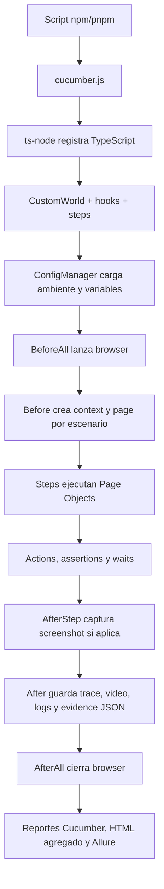

# Framework FRO TS

Framework de automatizacion E2E frontend con Playwright, TypeScript, Cucumber,
Gherkin y BDD. Esta pensado para equipos QA o desarrollo que necesitan escribir
escenarios legibles, ejecutarlos en distintos ambientes y browsers, y obtener
evidencias utiles para analizar resultados.

## Indice

- [1. Introduccion](#1-introduccion)
- [2. Requisitos previos](#2-requisitos-previos)
- [3. Instalacion paso a paso](#3-instalacion-paso-a-paso)
- [4. Comandos disponibles](#4-comandos-disponibles)
- [5. Crear un test nuevo](#5-crear-un-test-nuevo)
- [6. Arquitectura del proyecto](#6-arquitectura-del-proyecto)
- [7. Modulos principales](#7-modulos-principales)
- [8. Flujo completo de ejecucion](#8-flujo-completo-de-ejecucion)
- [9. Ambientes y variables](#9-ambientes-y-variables)
- [10. Cross-browser](#10-cross-browser)
- [11. Paralelismo](#11-paralelismo)
- [12. Reportes y evidencias](#12-reportes-y-evidencias)
- [13. CI/CD](#13-cicd)
- [14. Debugging y problemas frecuentes](#14-debugging-y-problemas-frecuentes)
- [15. Buenas practicas](#15-buenas-practicas)
- [16. Quick Start - primer dia](#16-quick-start---primer-dia)

## 1. Introduccion

Este framework permite automatizar pruebas end-to-end de frontend. Los tests se
escriben como escenarios Gherkin en archivos `.feature`, se conectan con step
definitions de Cucumber y ejecutan acciones reales en un navegador usando
Playwright.

Sirve para validar flujos de usuario desde la interfaz web, por ejemplo login,
navegacion, formularios, dashboards o cualquier flujo que pueda automatizarse
desde un browser.

Tecnologias principales:

| Tecnologia                           | Uso en el framework                         |
| ------------------------------------ | ------------------------------------------- |
| TypeScript                           | Lenguaje base del codigo                    |
| Cucumber / Gherkin                   | Runner BDD y definicion de escenarios       |
| Playwright                           | Automatizacion del navegador                |
| Page Object Model                    | Organizacion de pantallas y acciones        |
| Zod                                  | Validacion de variables de entorno          |
| dotenv                               | Carga de `.env`                             |
| Vitest                               | Tests unitarios del framework               |
| ESLint / Prettier                    | Calidad y formato                           |
| Allure                               | Reporte Allure                              |
| multiple-cucumber-html-reporter      | Reporte HTML agregado desde JSON Cucumber   |
| GitHub Actions / GitLab CI / Jenkins | Ejecucion CI/CD                             |
| Docker                               | Ejecucion reproducible en imagen Playwright |

Conocimientos minimos recomendados:

- Comandos basicos de terminal.
- JavaScript o TypeScript basico.
- Conceptos de HTML/CSS y selectores.
- Gherkin: `Feature`, `Scenario`, `Given`, `When`, `Then`.
- Playwright basico: `Page`, `Locator`, acciones y assertions.

Flujo general:

1. Se ejecuta un script de `package.json`.
2. Cucumber lee `cucumber.js`.
3. Se cargan `CustomWorld`, hooks y steps TypeScript con `ts-node`.
4. `ConfigManager` carga ambiente y variables.
5. Los hooks inicializan browser, context y page.
6. Cucumber ejecuta steps.
7. Los Page Objects usan managers de acciones, assertions y waits.
8. Se capturan screenshots, traces, videos y logs segun configuracion.
9. Se generan reportes Cucumber, Allure y evidencias propias.
10. Se cierran context y browser.

## 2. Requisitos previos

Software requerido:

| Requisito           | Version                                                           |
| ------------------- | ----------------------------------------------------------------- |
| Git                 | Cualquier version moderna                                         |
| Node.js             | Minimo `20.19.0`; recomendado `24` por `.node-version` y `.nvmrc` |
| pnpm                | `11.7.0`, definido en `packageManager`                            |
| Browsers Playwright | Instalados con `pnpm exec playwright install`                     |
| Docker              | Opcional, solo si se usa el `Dockerfile`                          |

El proyecto usa `pnpm-lock.yaml`, por lo que `pnpm` es el gestor recomendado.
Tambien existen scripts compatibles con `npm`, pero CI usa `pnpm`.

Variables de entorno soportadas:

| Variable             | Para que sirve                                               |
| -------------------- | ------------------------------------------------------------ |
| `TEST_ENV`           | Ambiente: `local`, `dev`, `qa`, `staging`, `prod`            |
| `BASE_URL`           | URL base de la aplicacion                                    |
| `BROWSER`            | Browser: `chromium`, `chrome`, `msedge`, `firefox`, `webkit` |
| `HEADLESS`           | `true` o `false`                                             |
| `HIGHLIGHT`          | Resalta elementos antes de interactuar                       |
| `SCREENSHOT_ON_STEP` | Captura screenshot despues de cada step                      |
| `VIDEO`              | Habilita video por escenario                                 |
| `TRACE`              | Habilita trace Playwright por escenario                      |
| `SLOW_MO`            | Delay de Playwright en milisegundos                          |
| `TEST_TIMEOUT`       | Timeout general del test                                     |
| `ACTION_TIMEOUT`     | Timeout de acciones/assertions                               |
| `NAVIGATION_TIMEOUT` | Timeout de navegacion                                        |
| `TEST_USERNAME`      | Usuario de prueba                                            |
| `TEST_PASSWORD`      | Password de prueba                                           |
| `CUCUMBER_TAGS`      | Expresion de tags                                            |
| `TAGS`               | Alias alternativo para tags                                  |
| `RETRY`              | Cantidad de retries                                          |
| `CUCUMBER_RETRY`     | Alias alternativo de retries                                 |
| `RETRY_TAG_FILTER`   | Tags permitidos para retry                                   |
| `PARALLEL`           | Workers paralelos de Cucumber                                |
| `ALLURE`             | Usar `false` para desactivar formatter Allure                |
| `DEBUG_LOGS`         | Habilita logs debug del `Logger` si vale `true`              |

Importante: no guardes credenciales reales, tokens ni secretos en el repositorio.
Usa `.env` local o secretos del sistema de CI.

## 3. Instalacion paso a paso

Desde una maquina nueva:

```bash
git clone https://github.com/facu231/Automation-Playwright-Fro-Ts.git
cd Automation-Playwright-Fro-Ts
corepack enable
corepack prepare pnpm@11.7.0 --activate
pnpm install
pnpm exec playwright install
```

Opcionalmente crea un `.env` local:

```bash
cp .env.example .env
```

En Windows PowerShell, si `cp` no esta disponible:

```powershell
Copy-Item .env.example .env
```

Valida que el framework compile y que los tests unitarios pasen:

```bash
pnpm run validate
```

Ejecuta el smoke existente:

```bash
pnpm run test:smoke
```

Si usas canales reales de Chrome, Edge o Firefox:

```bash
pnpm exec playwright install chrome msedge firefox
```

## 4. Comandos disponibles

Los comandos reales estan definidos en `package.json`.

| Comando                      | Que hace                                       | Cuando usarlo                  |
| ---------------------------- | ---------------------------------------------- | ------------------------------ |
| `npm test`                   | Ejecuta Cucumber con `cucumber.js`             | Corrida local default          |
| `npm run test:ci`            | Ejecuta Cucumber con `CI=true` y profile `ci`  | CI/CD                          |
| `npm run test:qa`            | Ejecuta con `TEST_ENV=qa`                      | Validar ambiente QA            |
| `npm run test:dev`           | Ejecuta con `TEST_ENV=dev`                     | Validar ambiente dev           |
| `npm run test:smoke`         | Ejecuta tags `@smoke`                          | Smoke rapido                   |
| `npm run test:regression`    | Ejecuta tags `@regression`                     | Regresion funcional            |
| `npm run test:parallel`      | Ejecuta con `PARALLEL=2`                       | Probar paralelismo local       |
| `npm run test:chrome`        | Ejecuta con `BROWSER=chrome`                   | Validar Google Chrome          |
| `npm run test:edge`          | Ejecuta con `BROWSER=msedge`                   | Validar Microsoft Edge         |
| `npm run test:firefox`       | Ejecuta con `BROWSER=firefox`                  | Validar Firefox                |
| `npm run test:flaky`         | Ejecuta `@flaky` con `RETRY=2`                 | Reintentos controlados         |
| `npm run test:headed`        | Ejecuta con `HEADLESS=false`                   | Ver browser en pantalla        |
| `npm run test:debug`         | Ejecuta con `PWDEBUG=1` y headed               | Debug interactivo              |
| `npm run test:unit`          | Ejecuta Vitest                                 | Tests unitarios del framework  |
| `npm run report`             | Genera reporte Cucumber HTML agregado y Allure | Despues de una corrida         |
| `npm run report:cucumber`    | Genera reporte HTML agregado                   | Solo reporte Cucumber agregado |
| `npm run report:allure`      | Genera Allure HTML                             | Solo reporte Allure            |
| `npm run report:allure:open` | Abre Allure                                    | Ver reporte Allure local       |
| `npm run clean:reports`      | Limpia reports, screenshots, videos y traces   | Antes de una corrida limpia    |
| `npm run typecheck`          | Ejecuta `tsc --noEmit`                         | Validar tipos                  |
| `npm run lint`               | Ejecuta ESLint                                 | Validar calidad                |
| `npm run lint:fix`           | Ejecuta ESLint con fix                         | Corregir problemas simples     |
| `npm run format`             | Ejecuta Prettier write                         | Formatear archivos             |
| `npm run format:check`       | Ejecuta Prettier check                         | Validar formato                |
| `npm run validate`           | Typecheck + lint + format check + unit tests   | Validacion completa local      |

Ejecutar todos los tests:

```bash
npm test
```

Ejecutar por suite/tag:

```bash
npm run test:smoke
npm run test:regression
```

Ejecutar por expresion de tags:

```bash
npx cross-env CUCUMBER_TAGS="@smoke and not @wip" npm test
```

Ejecutar por ambiente:

```bash
npm run test:qa
npm run test:dev
npx cross-env TEST_ENV=staging npm test
```

Ejecutar por browser:

```bash
npm run test:chrome
npm run test:edge
npm run test:firefox
npx cross-env BROWSER=chromium npm test
```

Ejecutar en paralelo:

```bash
npm run test:parallel
npx cross-env PARALLEL=4 npm test
```

Ejecutar con interfaz grafica:

```bash
npm run test:headed
```

Debug:

```bash
npm run test:debug
```

Ejecutar un archivo `.feature` especifico:

```bash
pnpm exec cucumber-js --config cucumber.js src/features/login.feature
```

No existe un script dedicado para ejecutar por nombre de escenario, pero Cucumber
permite usar su CLI directamente:

```bash
pnpm exec cucumber-js --config cucumber.js src/features/login.feature --name "Login exitoso con credenciales validas"
```

Generar reportes:

```bash
npm run report
npm run report:allure
npm run report:allure:open
```

## 5. Crear un test nuevo

Esta guia usa la arquitectura real del proyecto: features Gherkin, steps de
Cucumber, Page Objects y `CustomWorld`.

### Paso 1: crear la feature

Crea un archivo en `src/features`. Usa nombres descriptivos en kebab-case:

```text
src/features/productos.feature
```

Estructura recomendada:

```gherkin
@productos @smoke @desktop
Feature: Productos

  Como usuario autenticado
  Quiero ver el listado de productos
  Para poder elegir un producto

  @critical
  Scenario: Visualizar listado de productos
    Given que el usuario se encuentra en la pantalla de login
    When ingresa usuario "standard_user"
    And ingresa contrasena "<password-de-prueba>"
    And presiona el boton iniciar sesion
    Then deberia visualizar el listado de productos
```

Nota: el ejemplo reutiliza steps reales de login. En un proyecto real, evita
escribir secretos reales en el `.feature`; usa datos de prueba o variables.

### Paso 2: crear o reutilizar Page Objects

Los Page Objects viven en `src/pages`. El proyecto ya trae `LoginPage`.

Para una pantalla nueva, crea una clase que extienda `BasePage`:

```typescript
import type { Locator, Page } from 'playwright';
import type { EnvironmentConfig } from '../config/types';
import { BasePage } from '../core/BasePage';

export class ProductsPage extends BasePage {
  private readonly productList: Locator;

  constructor(page: Page, config?: EnvironmentConfig) {
    super(page, config);
    this.productList = page.locator('[data-test="inventory-list"]');
  }

  async assertProductListIsVisible(): Promise<void> {
    await this.assertions.assertVisible(this.productList, this.config.actionTimeout);
  }
}
```

### Paso 3: registrar la pagina en `PageFactory`

`PageFactory` centraliza instancias de Page Objects. Para una pagina nueva,
agrega una propiedad privada y un metodo publico similar a `login()`.

Ejemplo conceptual:

```typescript
private productsPage?: ProductsPage;

products(): ProductsPage {
  if (!this.productsPage) {
    this.productsPage = new ProductsPage(this.page, this.config);
  }

  return this.productsPage;
}
```

Si queres un acceso directo desde steps, agrega tambien un metodo en
`CustomWorld` siguiendo el patron de `getLoginPage()`.

### Paso 4: crear step definitions

Los steps viven en `src/steps`. Crea o extiende un archivo:

```text
src/steps/products.steps.ts
```

Ejemplo:

```typescript
import { Then } from '@cucumber/cucumber';
import type { CustomWorld } from '../support/world';

Then('deberia visualizar el listado de productos', async function (this: CustomWorld) {
  await this.pages?.products().assertProductListIsVisible();
});
```

El proyecto no tiene fixtures separados. El equivalente practico es
`CustomWorld`, que entrega `browser`, `context`, `page`, `pages`,
`screenshotManager` y `reporterManager`.

### Paso 5: manejar datos de prueba

Los datos JSON viven en `src/data`. El proyecto trae `users.json`.

Para agregar datos:

```json
{
  "validUser": {
    "username": "<usuario-de-prueba>",
    "password": "<password-de-prueba>"
  }
}
```

Para leerlos:

```typescript
import { DataManager } from '../core/DataManager';

interface TestUser {
  username: string;
  password: string;
}

const user = DataManager.getRecord<TestUser>('users.json', 'validUser');
```

### Paso 6: agregar tags

Tags existentes usados por el proyecto:

- `@smoke`
- `@regression`
- `@critical`
- `@flaky`
- `@wip`
- `@desktop`
- `@mobile`

`@wip` queda excluido por default porque `cucumber.js` usa `not @wip` cuando no
hay `CUCUMBER_TAGS`.

### Paso 7: ejecutar solo el test nuevo

Por tag:

```bash
npx cross-env CUCUMBER_TAGS="@productos" npm test
```

Por archivo:

```bash
pnpm exec cucumber-js --config cucumber.js src/features/productos.feature
```

### Paso 8: revisar resultados

Despues de ejecutar:

- Resultado en consola: formatter `progress`.
- JSON Cucumber: `reports/cucumber/cucumber-report.json`.
- HTML Cucumber: `reports/cucumber/cucumber-report.html`.
- Reporte HTML agregado: `reports/html`.
- Allure results: `reports/allure-results`.
- Allure HTML: `reports/allure-report`.
- Screenshots: `screenshots/<fecha>/<escenario>/<executionId>`.
- Traces: `traces/<fecha>/<escenario>/<executionId>`.
- Videos: `videos/<fecha>/<escenario>/<executionId>`.
- Evidencia propia: `reports/<fecha>/<escenario>/<executionId>/scenario-evidence.json`.

## 6. Arquitectura del proyecto

Arbol simplificado real:

```text
Framework-FRO-Ts/
|-- .github/
|   |-- actions/setup-framework/action.yml
|   `-- workflows/e2e.yml
|-- ci/
|   `-- gitlab-ci.yml
|-- reports/
|-- screenshots/
|-- traces/
|-- videos/
|-- src/
|   |-- config/
|   |-- core/
|   |-- data/
|   |-- features/
|   |-- hooks/
|   |-- pages/
|   |-- paths/
|   |-- steps/
|   |-- support/
|   |-- types/
|   `-- utils/
|-- cucumber.js
|-- playwright.config.ts
|-- vitest.config.ts
|-- eslint.config.mjs
|-- tsconfig.json
|-- Jenkinsfile
|-- Dockerfile
|-- package.json
`-- pnpm-lock.yaml
```

| Carpeta / archivo                 | Responsabilidad                           | Cuando tocarlo                                |
| --------------------------------- | ----------------------------------------- | --------------------------------------------- |
| `src/features`                    | Escenarios Gherkin                        | Al crear o modificar pruebas BDD              |
| `src/steps`                       | Step definitions Cucumber                 | Al conectar Gherkin con codigo                |
| `src/pages`                       | Page Objects                              | Al modelar pantallas o flujos                 |
| `src/core`                        | Managers y clases base del framework      | Solo para mejorar capacidades comunes         |
| `src/config`                      | Ambientes, tipos y validacion de env vars | Al agregar ambientes o variables              |
| `src/hooks`                       | Ciclo de vida Cucumber/Playwright         | Solo si cambia la inicializacion o evidencias |
| `src/support`                     | `CustomWorld` de Cucumber                 | Al exponer nuevos helpers a steps             |
| `src/data`                        | Datos JSON de prueba                      | Al agregar datasets                           |
| `src/utils`                       | Utilidades como generacion de reportes    | Al ajustar tooling                            |
| `src/paths`                       | Paths compartidos de artifacts            | Al necesitar rutas centralizadas              |
| `reports`                         | Reportes generados                        | No editar manualmente                         |
| `screenshots`                     | Screenshots generados                     | No editar manualmente                         |
| `videos`                          | Videos generados                          | No editar manualmente                         |
| `traces`                          | Traces Playwright generados               | No editar manualmente                         |
| `.github/workflows/e2e.yml`       | Pipeline GitHub Actions                   | Al cambiar CI de GitHub                       |
| `.github/actions/setup-framework` | Action compuesta de setup                 | Al cambiar setup CI                           |
| `ci/gitlab-ci.yml`                | Pipeline GitLab                           | Al cambiar CI de GitLab                       |
| `Jenkinsfile`                     | Pipeline Jenkins                          | Al cambiar Jenkins                            |
| `Dockerfile`                      | Imagen Docker                             | Al cambiar ejecucion containerizada           |

## 7. Modulos principales

| Modulo                             | Responsabilidad                                | Se relaciona con                    | Uso normal                               |
| ---------------------------------- | ---------------------------------------------- | ----------------------------------- | ---------------------------------------- |
| `ConfigManager`                    | Carga ambiente, `.env` y overrides             | `env.*.ts`, `env.schema.ts`         | Reutilizar                               |
| `env.schema.ts`                    | Valida variables con Zod                       | `ConfigManager`                     | Modificar si agregas env vars            |
| `env.local/dev/qa/staging/prod.ts` | Defaults por ambiente                          | `ConfigManager`                     | Modificar al cambiar ambientes           |
| `hooks.ts`                         | Abre browser/context/page y captura evidencias | `CustomWorld`, Playwright, managers | Tocar con cuidado                        |
| `CustomWorld`                      | Estado compartido por escenario                | Hooks, steps, PageFactory           | Agregar helpers para steps               |
| `BasePage`                         | Base para Page Objects                         | Actions, assertions, waits          | Extender                                 |
| `BaseComponent`                    | Base para componentes reutilizables            | Actions, assertions                 | Extender si hay componentes              |
| `ElementActions`                   | Click, fill, hover, upload, etc.               | `HighlightManager`, locators        | Reutilizar desde pages                   |
| `ElementAssertions`                | Assertions con auto-waiting Playwright         | `expect`, locators                  | Reutilizar desde pages                   |
| `WaitManager`                      | Esperas explicitas reutilizables               | Playwright `Page`/`Locator`         | Reutilizar si una assertion no alcanza   |
| `HighlightManager`                 | Resalta elementos antes de actuar              | `ElementActions`                    | Activar con `HIGHLIGHT=true`             |
| `locator.ts`                       | Normaliza string o `Locator` a `.first()`      | actions, assertions, waits          | Reutilizar internamente                  |
| `DataManager`                      | Lee JSON de `src/data`                         | `PathManager`                       | Usar para datos de prueba                |
| `PathManager`                      | Crea rutas, fechas, execution IDs y carpetas   | managers de evidencia               | Reutilizar                               |
| `ScreenshotManager`                | Captura screenshots full page                  | hooks, `BasePage`                   | Reutilizar                               |
| `ReporterManager`                  | Guarda logs/evidencias por escenario           | hooks                               | Reutilizar                               |
| `PageFactory`                      | Reutiliza Page Objects por escenario           | `CustomWorld`, pages                | Registrar nuevas pages                   |
| `LoginPage`                        | Page Object real de login                      | steps de login                      | Ejemplo a seguir                         |
| `generate-report.ts`               | Genera HTML agregado desde JSON Cucumber       | `multiple-cucumber-html-reporter`   | Ejecutar con `npm run report:cucumber`   |
| `Logger`                           | Logger simple a consola                        | `DEBUG_LOGS`                        | Disponible, poco usado actualmente       |
| `artifactPaths`                    | Rutas compartidas de artifacts                 | `PathManager`                       | Reutilizar si se necesita importar paths |

Funcionalidades implementadas:

- Runner BDD con Cucumber.
- Automatizacion browser con Playwright.
- Page Object Model.
- Ambientes `local`, `dev`, `qa`, `staging`, `prod`.
- Cross-browser por `BROWSER`.
- Paralelismo por `PARALLEL`.
- Retries controlados por `RETRY` y `RETRY_TAG_FILTER`.
- Screenshots por step o fallo.
- Trace y video configurables.
- Reportes Cucumber HTML/JSON, HTML agregado y Allure.
- CI/CD en GitHub Actions, GitLab CI y Jenkins.
- Dockerfile para ejecucion containerizada.

No implementado actualmente:

- No hay un script dedicado en `package.json` para ejecutar por nombre de
  escenario.
- No hay fixtures separados estilo Playwright Test; `CustomWorld` cumple ese rol.
- No hay tests E2E `.spec.ts` de Playwright Test; el runner E2E real es Cucumber.
- No hay manejo de secretos propio; se espera `.env` local o secretos del CI.

## 8. Flujo completo de ejecucion



Detalle:

1. El usuario ejecuta un comando, por ejemplo `npm run test:smoke`.
2. El script llama a `cucumber-js --config cucumber.js`.
3. `cucumber.js` registra `ts-node/register`, `src/support/world.ts`,
   `src/hooks/hooks.ts` y `src/steps/**/*.ts`.
4. Se calculan tags, retries y paralelismo desde variables de entorno.
5. `ConfigManager.load(true)` valida variables con Zod y aplica overrides sobre
   el ambiente base.
6. `BeforeAll` resuelve browser: `firefox`, `webkit`, `chromium`, `chrome` o
   `msedge`.
7. `Before` crea un `executionId`, un browser context y una page nueva por
   escenario.
8. Los steps usan `CustomWorld`, especialmente `getLoginPage()` o `pages`.
9. Los Page Objects usan `ElementActions`, `ElementAssertions` y `WaitManager`.
10. `AfterStep` captura screenshot si `SCREENSHOT_ON_STEP=true` o si falla el
    step.
11. `After` guarda status, screenshot de fallo, trace, video, logs y
    `scenario-evidence.json`.
12. `AfterAll` cierra el browser.

## 9. Ambientes y variables

Ambientes existentes:

| Ambiente  | Archivo                     | Particularidades                                                |
| --------- | --------------------------- | --------------------------------------------------------------- |
| `local`   | `src/config/env.local.ts`   | Base default, screenshot por step, trace activo, video inactivo |
| `dev`     | `src/config/env.dev.ts`     | Extiende `local`                                                |
| `qa`      | `src/config/env.qa.ts`      | Extiende `local`, video y trace activos                         |
| `staging` | `src/config/env.staging.ts` | Extiende `local`, video y trace activos                         |
| `prod`    | `src/config/env.prod.ts`    | Extiende `local`, screenshot por step, video y trace inactivos  |

Seleccionar ambiente:

```bash
npm run test:qa
npm run test:dev
npx cross-env TEST_ENV=staging npm test
```

Orden de configuracion:

1. Se elige ambiente con `TEST_ENV`. Si no se define, usa `local`.
2. Se carga el objeto `env.<ambiente>.ts`.
3. Se aplican overrides desde variables de entorno.
4. Zod valida tipos y valores antes de iniciar el browser.

Validaciones importantes:

- Booleanos aceptan `true`, `false`, `1`, `0`, `yes`, `no`, `y`, `n`.
- Numeros deben ser positivos.
- `BASE_URL` debe ser URL valida.
- `BROWSER=edge` se normaliza a `msedge`.

## 10. Cross-browser

Browsers soportados por configuracion:

| Valor `BROWSER` | Motor Playwright | Canal                        |
| --------------- | ---------------- | ---------------------------- |
| `chromium`      | Chromium         | Default Playwright           |
| `chrome`        | Chromium         | Google Chrome                |
| `msedge`        | Chromium         | Microsoft Edge               |
| `edge`          | Chromium         | Alias normalizado a `msedge` |
| `firefox`       | Firefox          | Default Playwright           |
| `webkit`        | WebKit           | Default Playwright           |

Comandos:

```bash
npm run test:chrome
npm run test:edge
npm run test:firefox
npx cross-env BROWSER=webkit npm test
```

Para instalar browsers:

```bash
pnpm exec playwright install chrome msedge firefox
```

Nota: `chrome` y `msedge` requieren los canales instalados por Playwright. Si no
estan instalados, el browser puede no iniciar.

## 11. Paralelismo

El paralelismo se controla con `PARALLEL`, que se mapea a la opcion `parallel`
de Cucumber.

```bash
npm run test:parallel
npx cross-env PARALLEL=4 npm test
```

Como funciona:

- `BeforeAll` lanza el browser.
- Cada escenario crea su propio context y page.
- Cada escenario recibe un `executionId` unico.
- Screenshots, videos, traces y reportes propios usan ese `executionId`.

Precauciones:

- Los escenarios deben ser independientes.
- Evita compartir estado global mutable entre scenarios.
- Evita depender del orden de ejecucion.
- Usa datos de prueba que no se pisen si varios escenarios corren al mismo
  tiempo.
- Si una aplicacion tiene usuarios o recursos limitados, ajusta `PARALLEL`.

Estructura de evidencias paralelas:

```text
screenshots/<fecha>/<escenario>/<executionId>/
reports/<fecha>/<escenario>/<executionId>/scenario-evidence.json
traces/<fecha>/<escenario>/<executionId>/
videos/<fecha>/<escenario>/<executionId>/
```

## 12. Reportes y evidencias

Formatters configurados en `cucumber.js`:

- `progress`: salida en consola.
- `json:reports/cucumber/cucumber-report.json`.
- `html:reports/cucumber/cucumber-report.html`.
- `allure-cucumberjs/reporter`, salvo que `ALLURE=false`.

Reportes:

| Reporte        | Ruta                                    | Como generarlo                                  |
| -------------- | --------------------------------------- | ----------------------------------------------- |
| Cucumber JSON  | `reports/cucumber/cucumber-report.json` | Se genera al correr tests                       |
| Cucumber HTML  | `reports/cucumber/cucumber-report.html` | Se genera al correr tests                       |
| HTML agregado  | `reports/html`                          | `npm run report:cucumber`                       |
| Allure results | `reports/allure-results`                | Se genera al correr tests si Allure esta activo |
| Allure HTML    | `reports/allure-report`                 | `npm run report:allure`                         |

Evidencias:

| Tipo                 | Ruta                                                               | Cuando aparece               |
| -------------------- | ------------------------------------------------------------------ | ---------------------------- |
| Screenshots por step | `screenshots/<fecha>/<escenario>/<executionId>`                    | Si `SCREENSHOT_ON_STEP=true` |
| Screenshot de fallo  | Misma carpeta de screenshots                                       | Si falla el escenario        |
| Trace                | `traces/<fecha>/<escenario>/<executionId>`                         | Si `TRACE=true`              |
| Video                | `videos/<fecha>/<escenario>/<executionId>`                         | Si `VIDEO=true`              |
| Evidence JSON        | `reports/<fecha>/<escenario>/<executionId>/scenario-evidence.json` | Al finalizar escenario       |

Generar reportes:

```bash
npm run report
```

Abrir Allure:

```bash
npm run report:allure:open
```

Limpiar evidencias:

```bash
npm run clean:reports
```

## 13. CI/CD

### GitHub Actions

Workflow real:

```text
.github/workflows/e2e.yml
```

Triggers:

- `push` a `main` o `master`.
- `pull_request`.
- `workflow_dispatch`.

Inputs manuales:

| Input                         | Default               | Uso                           |
| ----------------------------- | --------------------- | ----------------------------- |
| `tags`                        | `@smoke and not @wip` | Expresion Cucumber            |
| `parallel`                    | `2`                   | Workers por job               |
| `enable_self_hosted_fallback` | `false`               | Habilita fallback self-hosted |

Job principal `e2e-primary`:

| OS               | Browser   | Suite |
| ---------------- | --------- | ----- |
| `ubuntu-latest`  | `chrome`  | smoke |
| `ubuntu-latest`  | `msedge`  | smoke |
| `ubuntu-latest`  | `firefox` | smoke |
| `windows-latest` | `chrome`  | smoke |
| `macos-latest`   | `chrome`  | smoke |

La action compuesta `.github/actions/setup-framework/action.yml` hace:

1. `actions/setup-node@v4` usando `.node-version`.
2. `corepack enable`.
3. `corepack prepare pnpm@11.7.0 --activate`.
4. `pnpm install --frozen-lockfile`.
5. Instalacion de dependencias/browsers Playwright.

Clasificacion de fallos:

| `failure_type` | Significado                   | Dispara fallback                 |
| -------------- | ----------------------------- | -------------------------------- |
| `success`      | Todo paso                     | No                               |
| `infra`        | Fallo de setup antes de tests | Si, solo si el input lo habilita |
| `quality`      | Fallo en `pnpm run validate`  | No                               |
| `test`         | Fallo funcional de tests      | No                               |

Fallback self-hosted:

- Job: `e2e-self-hosted-fallback`.
- Runner requerido: labels `self-hosted`, `automation`, `playwright`.
- Solo corre si `enable_self_hosted_fallback=true` y se detecta
  `failure_type=infra`.
- No cambia dinamicamente el runner de un job iniciado; usa un job separado.
- Usa `max-parallel: 1` para evitar loops o saturacion.

Artifacts:

- `runner-classification-*`.
- `e2e-artifacts-*`.
- `e2e-fallback-artifacts-*` si corre fallback.

### GitLab CI

Archivo real:

```text
ci/gitlab-ci.yml
```

Usa la imagen `mcr.microsoft.com/playwright:v1.61.1-noble`, instala
dependencias con pnpm, valida con `pnpm run validate` y ejecuta matriz:

```text
chrome, msedge, firefox
```

Publica artifacts:

- `reports/`
- `screenshots/`
- `videos/`
- `traces/`

### Jenkins

Archivo real:

```text
Jenkinsfile
```

Stages:

1. Checkout.
2. Install dependencies.
3. Validate framework.
4. Run browser matrix: `chrome`, `msedge`, `firefox`.
5. Publish reports.

### Docker

Archivo real:

```text
Dockerfile
```

Construir:

```bash
docker build -t framework-fro-ts .
```

Ejecutar smoke default:

```bash
docker run --rm framework-fro-ts
```

Ejecutar con tags:

```bash
docker run --rm -e CUCUMBER_TAGS="@regression and not @wip" framework-fro-ts
```

## 14. Debugging y problemas frecuentes

### El navegador no inicia

Posibles causas:

- Browser no instalado.
- `BROWSER` tiene un valor no soportado.
- Canal `chrome` o `msedge` no instalado.

Diagnostico:

```bash
pnpm exec playwright install chrome msedge firefox
npx cross-env BROWSER=chromium npm test
```

### Falla la configuracion de ambiente

Posibles causas:

- `TEST_ENV` invalido.
- `BASE_URL` no es una URL valida.
- Booleanos o numeros con formato invalido.

Diagnostico:

```bash
npm run test:unit
npx cross-env TEST_ENV=qa npm test
```

El error de Zod empieza con:

```text
Invalid environment configuration
```

### Un elemento no puede localizarse

Posibles causas:

- Selector incorrecto o inestable.
- La pagina todavia no cargo.
- El elemento esta oculto.

Diagnostico:

```bash
npm run test:headed
npm run test:debug
```

Buenas pistas:

- Revisar el Page Object.
- Preferir selectores `data-test`, roles o ids estables.
- Usar assertions de `ElementAssertions` antes que esperas manuales repetidas.

### El reporte no se genera

Posibles causas:

- No existe `reports/cucumber/cucumber-report.json`.
- La corrida fallo antes de iniciar Cucumber.
- `ALLURE=false` desactivo results de Allure.

Diagnostico:

```bash
npm test
npm run report
```

Si falta el JSON, `report:cucumber` muestra un warning y termina sin error.

### El test pasa localmente pero falla en CI

Posibles causas:

- Diferente OS/browser.
- Datos compartidos entre tests.
- Timeout bajo.
- Variable de entorno no configurada en CI.
- Diferencia entre headed local y headless CI.

Diagnostico:

```bash
npx cross-env HEADLESS=true TEST_ENV=qa BROWSER=chrome npm test
npx cross-env PARALLEL=2 npm run test:smoke
```

Revisar artifacts del workflow:

- Screenshots.
- Traces.
- Videos.
- `scenario-evidence.json`.

### Fallan tests al ejecutarse en paralelo

Posibles causas:

- Escenarios dependen del orden.
- Se comparte un usuario o recurso que no soporta concurrencia.
- Datos de prueba se pisan.

Diagnostico:

```bash
npx cross-env PARALLEL=1 npm test
npx cross-env PARALLEL=2 npm test
```

Si falla solo con `PARALLEL>1`, revisar independencia de datos y estado.

### No se ven logs debug

`Logger.debug()` solo escribe si:

```bash
DEBUG_LOGS=true
```

## 15. Buenas practicas

- Escribir escenarios Gherkin legibles y orientados a negocio.
- Usar tags consistentes: `@smoke`, `@regression`, `@critical`, `@flaky`.
- Usar `@wip` para escenarios en construccion; quedan fuera por default.
- Mantener steps cortos; la logica debe vivir en Page Objects o managers.
- Crear Page Objects por pantalla o flujo estable.
- Registrar Page Objects nuevos en `PageFactory`.
- Agregar helpers en `CustomWorld` solo cuando faciliten steps.
- Preferir selectores estables: `data-test`, roles accesibles o ids claros.
- Evitar `waitForTimeout`; usar `ElementAssertions` o `WaitManager`.
- Mantener datos de prueba en `src/data` cuando sean reutilizables.
- No guardar secretos reales en `.feature`, `.json`, README ni configs.
- Mantener scenarios independientes para paralelismo.
- No ocultar bugs con retries; reservar `@flaky` para casos justificados.
- No modificar `src/core` para resolver un caso puntual si alcanza con un Page
  Object.
- Ejecutar `npm run validate` antes de subir cambios.

## 16. Quick Start - primer dia

1. Clonar e instalar:

```bash
git clone https://github.com/facu231/Automation-Playwright-Fro-Ts.git
cd Automation-Playwright-Fro-Ts
corepack enable
corepack prepare pnpm@11.7.0 --activate
pnpm install
pnpm exec playwright install
```

2. Crear `.env` local:

```bash
cp .env.example .env
```

3. Validar el framework:

```bash
npm run validate
```

4. Ejecutar el smoke existente:

```bash
npm run test:smoke
```

5. Ver evidencias:

```text
reports/
screenshots/
traces/
videos/
```

6. Generar reportes:

```bash
npm run report
```

7. Crear un test simple:

- Crear `src/features/mi-flujo.feature`.
- Agregar tags, feature y scenario.
- Reutilizar steps existentes o crear uno en `src/steps`.
- Crear Page Object en `src/pages` si la pantalla no existe.
- Registrar la page en `PageFactory`.

8. Ejecutar solo el test:

```bash
pnpm exec cucumber-js --config cucumber.js src/features/mi-flujo.feature
```

9. Si falla:

```bash
npm run test:headed
npm run test:debug
```

10. Antes de subir:

```bash
npm run validate
```
